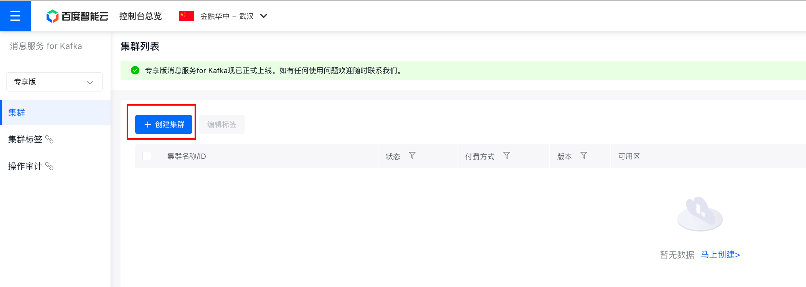
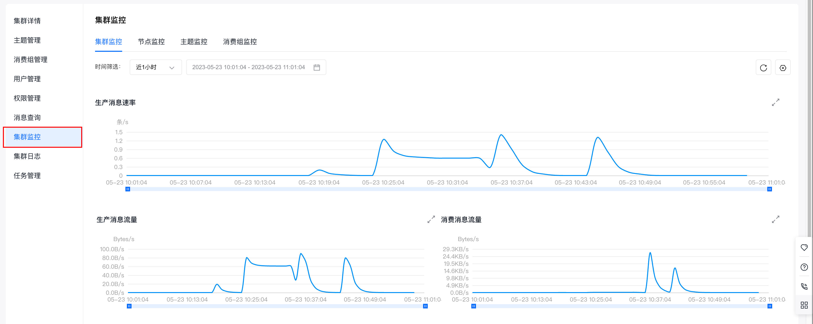

# 公网SASL_SSL方式生产和消费消息
在 Kafka 集群所在 VPC 网络外访问，使用 SASL_SSL 协议接入，接入点可以在 【集群详情】 页面查看。
## 环境准备
1. [安装Go](https://golang.org/dl/)。
2. 下载Go kafka 客户端。
```shell
   go get github.com/confluentinc/confluent-kafka-go
```
## 集群准备
### 1. 购买专享版消息服务for Kafka集群
开通消息服务 for Kafka服务后，在控制台页面点击『创建集群』，即可进行购买。

### 2. 为购买的集群创建主题
在控制台页面点击集群名称，进入集群详情页面。
在左侧的边栏中点击『主题管理』，进入主题管理页面。

在主题管理页面点击『创建主题』，进行主题的创建。
## 使用步骤
### 步骤一：获取集群接入点
具体请参考：[接入点查看]()。

### 步骤二：下载ssl.cert.zip证书文件
下载证书文件：[ssl.cert.zip](https://bce-kafka-bj.bj.bcebos.com/cert/ssl.cert.zip)
### 步骤三：编写测试代码
* 需要关注并自行修改的参数

| 参数名               | 含义      |
|-------------------|---------|
| bootstrap_servers | 接入点信息   |
| topic_name        | 主题名称    |
| group_id          | 消费组id   |
| ssl.ca.location                  | client.truststore.pem证书文件所在路径        |
| sasl.username                  | 用户管理中创建用户的用户名        |
| sasl.password                  |用户管理中创建用户的密码         |
用户创建请参考：[用户创建]()。
#### 生产者代码示例
创建KafkaProducerDemo.go文件，具体代码示例如下：
```go
package main

import (
	"fmt"
	"github.com/confluentinc/confluent-kafka-go/kafka"
)

func main() {

	var kafkaconf = &kafka.ConfigMap{
		// 接入点
		"bootstrap.servers": "接入点",
		// 接入协议
		"security.protocol": "sasl_ssl",
		// 证书文件路径
		"ssl.ca.location": "client.truststore.pem",
		// SASL 机制
		"sasl.mechanism": "SCRAM-SHA-512",
		// SASL 用户名
		"sasl.username": "alice",
		// SASL 用户密码
		"sasl.password": "alice1234!",
	}

	p, err := kafka.NewProducer(kafkaconf)
	if err != nil {
		panic(err)
	}

	defer p.Close()

	// Delivery report handler for produced messages
	go func() {
		for e := range p.Events() {
			switch ev := e.(type) {
			case *kafka.Message:
				if ev.TopicPartition.Error != nil {
					fmt.Printf("Delivery failed: %v\n", ev.TopicPartition)
				} else {
					fmt.Printf("Delivered message to %v\n", ev.TopicPartition)
				}
			}
		}
	}()

	// 填写创建的主题名称
	topic := "topic_name"
	for _, word := range []string{"Golang", "for", "kafka", "client", "test"} {
		p.Produce(&kafka.Message{
			TopicPartition: kafka.TopicPartition{Topic: &topic, Partition: kafka.PartitionAny},
			Value:          []byte(word),
		}, nil)
	}

	// Wait for message deliveries before shutting down
	p.Flush(15 * 1000)
}
```
#### 消费者代码示例
创建KafkaConsumerDemo.go文件，具体代码示例如下：
```go
package main

import (
	"fmt"
	"github.com/confluentinc/confluent-kafka-go/kafka"
)


func main() {

	var kafkaconf = &kafka.ConfigMap{
		// 接入点
		"bootstrap.servers": "接入点",
		// 接入协议
		"security.protocol": "sasl_ssl",
		// 证书文件路径
		"ssl.ca.location": "client.truststore.pem",
		// SASL 机制
		"sasl.mechanism": "SCRAM-SHA-512",
		// SASL 用户名
		"sasl.username": "alice",
		// SASL 用户密码
		"sasl.password": "alice1234!",
		// 消费组 id
		"group.id": "test_group",
		"auto.offset.reset": "earliest",
	}

	c, err := kafka.NewConsumer(kafkaconf)

	if err != nil {
		panic(err)
	}

	c.SubscribeTopics([]string{"topic_name"}, nil)

	for {
		msg, err := c.ReadMessage(-1)
		if err == nil {
			fmt.Printf("Message on %s: %s\n", msg.TopicPartition, string(msg.Value))
		} else {
			// The client will automatically try to recover from all errors.
			fmt.Printf("Consumer error: %v (%v)\n", err, msg)
		}
	}

	c.Close()
}
```
### 步骤四：编译并运行
编译并运行上述两个代码文件。
```shell
# 启动消费者
go consumer.go
# 启动生产者
go producer.go
```
### 步骤五：查看集群监控
查看消息是否发送成功或消费成功有两种方式：
1. 在服务器端/控制台查看日志。
2. 在专享版消息服务 for Kafka控制台查看集群监控，获取集群生产、消息情况。

推荐使用第二种方式，下面介绍如何查看集群监控。

（1）在专享版消息服务 for Kafka的控制台页面找到需要连接的集群，点击集群名称进入『集群详情』页面。

（2）页面跳转后，进入左侧边中的『集群详情』页面。

（3）点击左侧边栏中的『集群监控』，进入『集群监控』页面。

（4）通过查看『集群监控』页面，提供的不同纬度的监控信息（集群监控、节点监控、主题监控、消费组监控），即可获知集群的生产和消费情况。
集群监控的具体使用请参考：[集群监控]()
