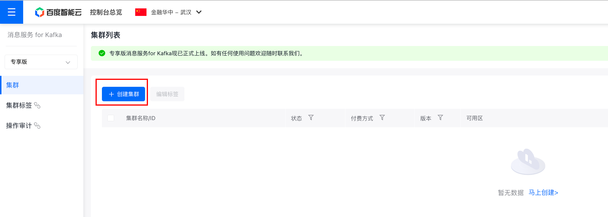
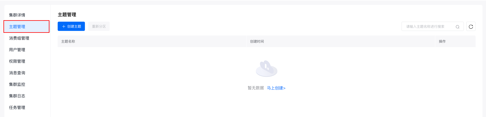
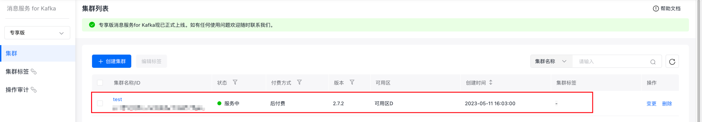
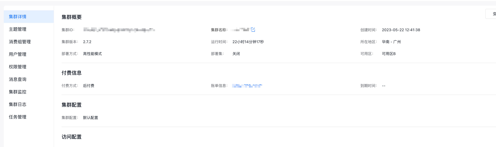
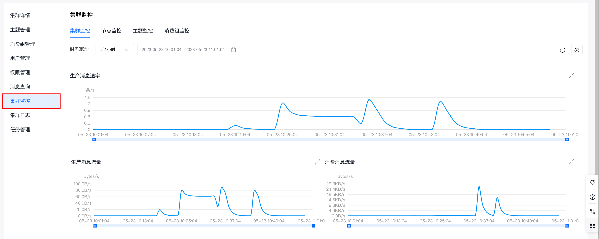
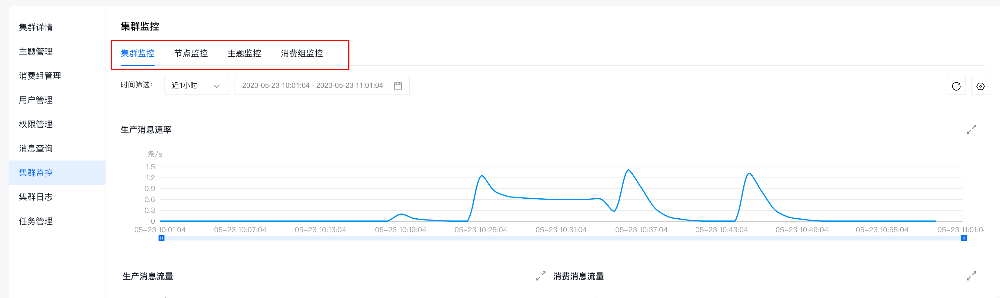

在同 VPC 网络下访问，使用 SASL_PLAINTEXT 协议接入，接入点可以在 【集群详情】 页面查看。
## 环境准备
1. [安装1.8或以上版本 JDK](https://www.oracle.com/java/technologies/downloads/)
2. [安装2.5或以上版本 Maven](https://maven.apache.org/download.cgi)
## 集群准备
### 1. 购买专享版消息服务for Kafka集群
   开通消息服务 for Kafka服务后，在控制台页面点击『创建集群』，即可进行购买。

### 2. 为购买的集群创建主题
   在控制台页面点击集群名称，进入集群详情页面。
   在左侧的边栏中点击『主题管理』，进入主题管理页面。

在主题管理页面点击『创建主题』，进行主题的创建。
## 使用步骤
### 步骤一：获取集群接入点
具体请参考：[接入点查看]()。
### 步骤二：添加Maven配置
```xml
<dependencies>
    <dependency>
        <groupId>org.apache.kafka</groupId>
        <artifactId>kafka-clients</artifactId>
        <version>2.7.2</version>
    </dependency>
<!-- https://mvnrepository.com/artifact/org.apache.maven.plugins/maven-assembly-plugin -->
    <dependency>
        <groupId>org.apache.maven.plugins</groupId>
        <artifactId>maven-assembly-plugin</artifactId>
        <version>3.5.0</version>
    </dependency>
</dependencies>
```
### 步骤三：创建JAAS 配置文件
创建 jaas 配置文件 kafka_client_jaas.conf
```java
KafkaClient {
org.apache.kafka.common.security.scram.ScramLoginModule sufficient
username="alice"
password="alice_pass";
};
```
username，password 填创建用户时设置的值。
创建用户请参考：[创建用户]()
### 步骤四：创建kafka.properties配置文件
提供接入 Kafka 服务需要的配置信息，配置项如下：
* bootstrap.servers  配置为接入点地址，具体请参考[接入点查看]()。
* security.protocol    固定为 SASL_PLAINTEXT
* sasl.mechanism    固定为 SCRAM-SHA-512
* java.security.auth.login.config  配置为 kafka_client_jaas.conf 路径
```xml
  bootstrap.servers=<接入点地址>

   security.protocol=SASL_PLAINTEXT

   sasl.mechanism=SCRAM-SHA-512

   java.security.auth.login.config=/etc/kafka/kafka_client_jaas.conf 
```
kafka.properties  可以作为 resources 文件与代码一起打包，代码运行时会在 classpath 中寻找 kafka.properties 文件资源；也可以在运行代码时将 kafka.properties 置于进程工作目录同级的 config 目录下。

### 步骤五：编写测试代码
* 需要关注并自行修改的参数

| 参数名      | 含义      |
|----------|---------|
| path     | 接入点信息kafka.properties所在路径（建议写文件所在的绝对路径）     |
| topic    | 主题名称    |
| message  | 消息的具体内容 |
| group_id | 消费组id   |
#### 生产者代码示例
创建KafkaProducerDemo.java文件，具体代码示例如下：
```java
package org.example.Java示例.SASL_PLAINTEXT;

import org.apache.kafka.clients.producer.KafkaProducer;
import org.apache.kafka.clients.producer.ProducerConfig;
import org.apache.kafka.clients.producer.ProducerRecord;
import org.apache.kafka.clients.producer.RecordMetadata;

import java.io.File;
import java.io.FileInputStream;
import java.io.IOException;
import java.util.Properties;

public class baidu.kafka.KafkaProducerDemo {
    public static void main(String[] args) throws IOException {

        // 需要自行配置下面三个参数
        // kafka.properties所在路径（建议写文件所在的绝对路径）
        String path = "kafka.properties";
        // 主题名称-topic name
        String topic = "test";
        // 消息内容
        String message = "kafka java test";

        // 创建配置类，并获取配置文件 kafka.properties 的内容。
        Properties properties = new Properties();
        File file = new File(path);
        try {
            if (file.exists()) {
                // 如果通过用户指定的path路径找到了kafka.properties文件，则加载kafka.properties中的配置项
                properties.load(new FileInputStream(file));
            } else {
                // 如果没有从path中找到，则从KafkaProducerDemo所在的路径去查找
                properties.load(
                        baidu.kafka.KafkaProducerDemo.class.getClassLoader().getResourceAsStream("kafka.properties")
                );
            }
        } catch (IOException e) {
            // 没找到kafka.properties文件，在此处处理异常
            throw e;
        }

        // 设置 java.security.auth.login.config，用于加载kafka_client_jaas.conf文件
        if (null == System.getProperty("java.security.auth.login.config")) {
            System.setProperty(
                    "java.security.auth.login.config",
                    properties.getProperty("java.security.auth.login.config")
            );
        }

        // Kafka消息的序列化方式。
        properties.put(ProducerConfig.KEY_SERIALIZER_CLASS_CONFIG, "org.apache.kafka.common.serialization.StringSerializer");
        properties.put(ProducerConfig.VALUE_SERIALIZER_CLASS_CONFIG, "org.apache.kafka.common.serialization.StringSerializer");
        // 请求的最长等待时间。
        properties.put(ProducerConfig.MAX_BLOCK_MS_CONFIG, 30 * 1000);
        // 设置客户端内部重试次数。
        properties.put(ProducerConfig.RETRIES_CONFIG, 5);
        // 设置客户端内部重试间隔。
        properties.put(ProducerConfig.RECONNECT_BACKOFF_MS_CONFIG, 3000);

        // 构建kafkaProducer对象
        KafkaProducer<String, String> kafkaProducer = new KafkaProducer<>(properties);

        try {
            // 向指定的topic发送100条消息
            for (int i = 0; i < 100; i++) {
                // 通过 ProducerRecord 构造一个消息对象
                ProducerRecord<String, String> kafkaMessage =  new ProducerRecord<>(topic, message + "-" + i);
                // 通过kafkaProducer发送消息
                kafkaProducer.send(kafkaMessage, (RecordMetadata recordMetadata, Exception e) -> {
                    // 发送信息后的回调函数，用以验证消息是否发送成功
                    if (e == null) {
                        System.out.println("send success:" + recordMetadata.toString());
                    } else {
                        e.printStackTrace();
                        System.err.println("send failed");
                    }
                });
            }
        }catch (Exception e){
            System.out.println(e.getMessage());
            e.printStackTrace();
        }finally {
            // 不要忘记关闭资源
            kafkaProducer.close();
        }
    }
}
```
#### 消费者代码示例
创建KafkaConsumerDemo.java文件，具体代码示例如下：
```java
package org.example.Java示例.SASL_PLAINTEXT;

import org.apache.kafka.clients.consumer.ConsumerConfig;
import org.apache.kafka.clients.consumer.ConsumerRecord;
import org.apache.kafka.clients.consumer.ConsumerRecords;
import org.apache.kafka.clients.consumer.KafkaConsumer;

import java.io.File;
import java.io.FileInputStream;
import java.io.IOException;
import java.time.Duration;
import java.util.Collections;
import java.util.Properties;

public class baidu.kafka.KafkaConsumerDemo {
   public static void main(String[] args) throws IOException {

      // 需要自行配置下面三个参数
      // kafka.properties所在路径（建议写文件所在的绝对路径）
      String path = "kafka.properties";
      // 主题名称-topic name
      String topic = "test";
      // 消费组id
      String group_id = "test_group";

      // 创建配置类，并获取配置文件 kafka.properties 的内容。
      Properties properties = new Properties();
      File file = new File(path);
      try {
         if (file.exists()) {
            // 如果通过用户指定的path路径找到了kafka.properties文件，则加载kafka.properties中的配置项
            properties.load(new FileInputStream(file));
         } else {
            // 如果没有从path中找到，则从KafkaProducerDemo所在的路径去查找
            properties.load(
                    baidu.kafka.KafkaProducerDemo.class.getClassLoader().getResourceAsStream("kafka.properties")
            );
         }
      } catch (IOException e) {
         // 没找到kafka.properties文件，在此处处理异常
         throw e;
      }

      // 设置 java.security.auth.login.config，用于加载kafka_client_jaas.conf文件
      if (null == System.getProperty("java.security.auth.login.config")) {
         System.setProperty(
                 "java.security.auth.login.config",
                 properties.getProperty("java.security.auth.login.config")
         );
      }

      // Kafka消息的序列化方式
      properties.put(ConsumerConfig.KEY_DESERIALIZER_CLASS_CONFIG, "org.apache.kafka.common.serialization.StringDeserializer");
      properties.put(ConsumerConfig.VALUE_DESERIALIZER_CLASS_CONFIG, "org.apache.kafka.common.serialization.StringDeserializer");
      // 指定消费组id
      properties.put(ConsumerConfig.GROUP_ID_CONFIG, group_id);
      // enable.auto.commit如果为true，则消费者的偏移量将定期在后台提交。
      properties.put(ConsumerConfig.ENABLE_AUTO_COMMIT_CONFIG, "true");
      // 重置消费位点策略:earliest、latest、none
      properties.put(ConsumerConfig.AUTO_OFFSET_RESET_CONFIG, "earliest");
      // 设置kafka自动提交offset的频率，默认5000ms，也就是5s
      properties.put(ConsumerConfig.AUTO_COMMIT_INTERVAL_MS_CONFIG, 1000);
      // 设置消费者在一次poll中返回的最大记录数
      properties.put(ConsumerConfig.MAX_POLL_RECORDS_CONFIG, 1000);
      // 设置消费者两次poll的最大时间间隔
      properties.put(ConsumerConfig.MAX_POLL_INTERVAL_MS_CONFIG, 1000);

      // 构建KafkaConsumer对象
      KafkaConsumer<String, String> kafkaConsumer = new KafkaConsumer<>(properties);

      //订阅主题
      kafkaConsumer.subscribe(Collections.singleton(topic));

      try{
         //持续消费主题中的消息
         while(true){
            // 构建ConsumerRecord用于接收存储消息
            ConsumerRecords<String, String> kafkaMessage = kafkaConsumer.poll(Duration.ofMillis(5000));
            for (ConsumerRecord<String, String> consumerRecord : kafkaMessage) {
               // 打印消息具体内容
               System.out.printf("offset = %d, key = %s, value = %s%n", consumerRecord.offset(), consumerRecord.key(), consumerRecord.value());
            }
         }
      }catch (Exception e){
         System.out.println(e.getMessage());
         e.printStackTrace();
      }finally {
         kafkaConsumer.close();
      }
   }
}
```
### 步骤六：编译并运行
编译并运行上述两个代码文件。
* 先启动KafkaConsumerDemo.java，再启动KafkaProducerDemo.java
### 步骤七：查看集群监控
查看消息是否发送成功或消费成功有两种方式：
1. 在服务器端/控制台查看日志。
2. 在专享版消息服务 for Kafka控制台查看集群监控，获取集群生产、消息情况。

推荐使用第二种方式，下面介绍如何查看集群监控。

（1）在专享版消息服务 for Kafka的控制台页面找到需要连接的集群，点击集群名称进入『集群详情』页面。

（2）页面跳转后，进入左侧边中的『集群详情』页面。

（3）点击左侧边栏中的『集群监控』，进入『集群监控』页面。

（4）通过查看『集群监控』页面，提供的不同纬度的监控信息（集群监控、节点监控、主题监控、消费组监控），即可获知集群的生产和消费情况。
集群监控的具体使用请参考：[集群监控]()



