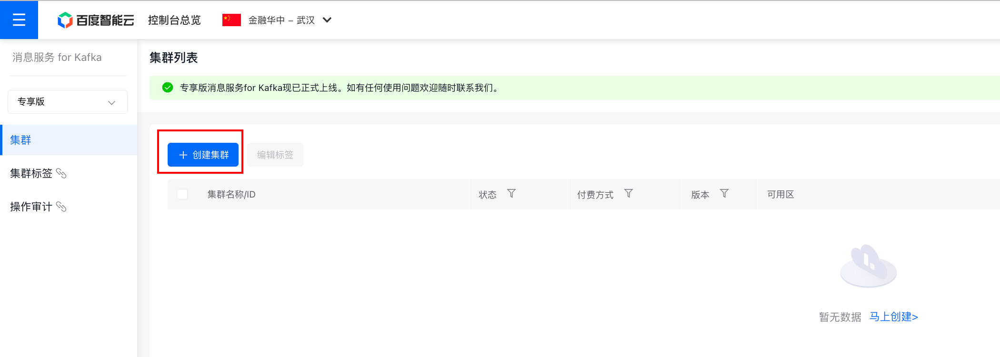
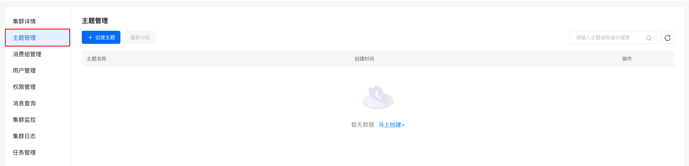
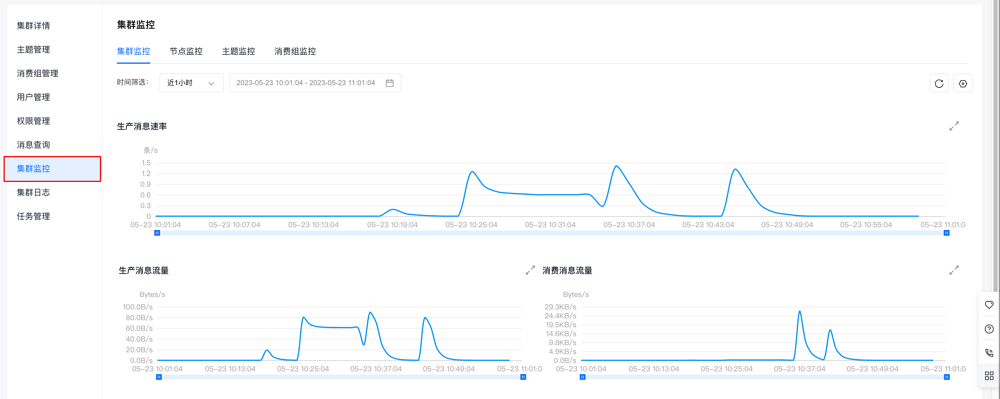

# 公网SASL_SSL方式生产和消费消息
在 Kafka 集群所在 VPC 网络外访问，使用 SASL_SSL 协议接入，接入点可以在 【集群详情】 页面查看。
## 环境准备
1. 安装C++依赖库
```shell
yum install librdkafka-devel
```
2. 安装PHP依赖库
```shell
pecl install rdkafka
# 在PHP的初始化文件php.ini中添加以下语句以开启扩展
extension=rdkafka.so
php -m | grep kafka
rdkafka
```
3. 使用php-rdkafka sdk：https://arnaud.le-blanc.net/php-rdkafka-doc/phpdoc/index.html
```shell
$ git clone https://github.com/arnaud-lb/php-rdkafka.git
$ cd php-rdkafka
$ phpize
$ ./configure
$ make all -j 5
$ sudo make install
```
## 集群准备
### 1. 购买专享版消息服务for Kafka集群
开通消息服务 for Kafka服务后，在控制台页面点击『创建集群』，即可进行购买。

### 2. 为购买的集群创建主题
在控制台页面点击集群名称，进入集群详情页面。
在左侧的边栏中点击『主题管理』，进入主题管理页面。

在主题管理页面点击『创建主题』，进行主题的创建。
## 使用步骤
### 步骤一：获取集群接入点
具体请参考：[接入点查看]()。

### 步骤二：下载ssl.cert.zip证书文件
下载证书文件：[ssl.cert.zip](https://bce-kafka-bj.bj.bcebos.com/cert/ssl.cert.zip)

### 步骤三：编写测试代码
* 需要关注并自行修改的参数

| 参数名                  | 含义                   |
|----------------------|----------------------|
| metadata.broker.list | 接入点信息                |
| topic_name           | 主题名称                 |
| group_id             | 消费组id                |
| ssl.ca.location      | ssl.cert.zip证书文件所在路径 |
| sasl.username        | 用户管理中创建用户的用户名        |
| sasl.password        | 用户管理中创建用户的密码         |

用户创建请参考：[用户创建]()。
#### 生产者代码示例
创建KafkaProducerDemo.php文件，具体代码示例如下：
```phpregexp
<?php

$conf = new RdKafka\Conf();
// 接入点
$conf->set('metadata.broker.list', '接入点');
// 接入协议
$conf->set('security.protocol','sasl_ssl');
// 证书文件路径（证书文件请参考"接入点查看"文档）
$conf->set('ssl.ca.location',__DIR__.'/ssl.cert/client.truststore.pem');
// SASL 机制
$conf->set('sasl.mechanism','SCRAM-SHA-512');
// SASL 用户名
$conf->set('sasl.username','alice');
// SASL 密码
$conf->set('sasl.password','alice1234!');

$producer = new RdKafka\Producer($conf);

// 指定topic
$topic = $producer->newTopic("topic_name");

for ($i = 0; $i < 10; $i++) {
    // RD_KAFKA_PARTITION_UA自动选择分区，message指定想要发送的消息
    $topic->produce(RD_KAFKA_PARTITION_UA, 0, "Message $i : php sasl_ssl");
    $producer->poll(0);
}

for ($flushRetries = 0; $flushRetries < 10; $flushRetries++) {
    $result = $producer->flush(10000);
    if (RD_KAFKA_RESP_ERR_NO_ERROR === $result) {
        break;
    }
}

if (RD_KAFKA_RESP_ERR_NO_ERROR !== $result) {
    throw new \RuntimeException('Was unable to flush, messages might be lost!');
}
```
#### 消费者代码示例
创建KafkaConsumerDemo.php文件，具体代码示例如下：
```phpregexp
<?php

$conf = new RdKafka\Conf();
// 接入协议
$conf->set('security.protocol','sasl_ssl');
// SASL 机制
$conf->set('sasl.mechanism','SCRAM-SHA-512');
// SASL 用户名
$conf->set('sasl.username','alice');
// SASL 密码
$conf->set('sasl.password','alice1234!');
// 证书文件路径
$conf->set('ssl.ca.location',__DIR__.'/ssl.cert/client.truststore.pem');
// 消费组 id
$conf->set('group.id', 'php-group');

$rk = new RdKafka\Consumer($conf);
// 接入点
$rk->addBrokers("120.48.16.84:9095,120.48.159.11:9095,180.76.99.163:9095");

$topicConf = new RdKafka\TopicConf();
$topicConf->set('auto.commit.interval.ms', 100);
$topicConf->set('offset.store.method', 'broker');
$topicConf->set('auto.offset.reset', 'earliest');

//订阅topic
$topic = $rk->newTopic("topic_name", $topicConf);

$topic->consumeStart(0, RD_KAFKA_OFFSET_STORED);

while (true) {
    $message = $topic->consume(0, 120*10000);
    switch ($message->err) {
        case RD_KAFKA_RESP_ERR_NO_ERROR:
            var_dump($message);
            break;
        case RD_KAFKA_RESP_ERR__PARTITION_EOF:
            echo "No more messages; will wait for more\n";
            break;
        case RD_KAFKA_RESP_ERR__TIMED_OUT:
            echo "Timed out\n";
            break;
        default:
            throw new \Exception($message->errstr(), $message->err);
            break;
    }
}
```
### 步骤四：编译并运行
编译并运行上述两个代码文件。
```shell
# 启动消费者
php consumer.php
# 启动生产者
php producer.php
```
### 步骤五：查看集群监控
查看消息是否发送成功或消费成功有两种方式：
1. 在服务器端/控制台查看日志。
2. 在专享版消息服务 for Kafka控制台查看集群监控，获取集群生产、消息情况。

推荐使用第二种方式，下面介绍如何查看集群监控。

（1）在专享版消息服务 for Kafka的控制台页面找到需要连接的集群，点击集群名称进入『集群详情』页面。

（2）页面跳转后，进入左侧边中的『集群详情』页面。

（3）点击左侧边栏中的『集群监控』，进入『集群监控』页面。

（4）通过查看『集群监控』页面，提供的不同纬度的监控信息（集群监控、节点监控、主题监控、消费组监控），即可获知集群的生产和消费情况。
集群监控的具体使用请参考：[集群监控]()
