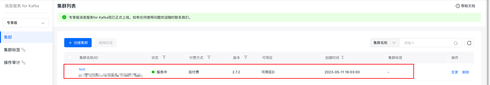

# VPC网络SASL_PLAINTEXT方式生产和消费消息
在同 VPC 网络下访问，使用 SASL_PLAINTEXT 协议接入，接入点可以在 【集群详情】 页面查看。
## 环境准备
1. [安装 Python](https://www.python.org/downloads/)
2. [安装 pip](https://pip-cn.readthedocs.io/en/latest/installing.html)
3. 运行如下命令下载confluent-kafka依赖。
```shell
   pip install confluent-kafka
```
## 集群准备
### 1. 购买专享版消息服务for Kafka集群
开通消息服务 for Kafka服务后，在控制台页面点击『创建集群』，即可进行购买。

### 2. 为购买的集群创建主题
在控制台页面点击集群名称，进入集群详情页面。
在左侧的边栏中点击『主题管理』，进入主题管理页面。

在主题管理页面点击『创建主题』，进行主题的创建。
## 使用步骤
### 步骤一：获取集群接入点
具体请参考：[接入点查看]()。
### 步骤二：编写测试代码
* 需要关注并自行修改的参数

| 参数名               | 含义      |
|-------------------|---------|
| bootstrap.servers | 接入点信息   |
| topic_name        | 主题名称    |
| message           | 消息的具体内容 |
| group_id          | 消费组id   |
|     sasl.username              |    用户管理中创建用户的用户名     |
|      sasl.password                          |   用户管理中创建用户的密码                   |
用户创建请参考：[用户创建]()。
#### 生产者代码示例
创建KafkaProducerDemo.py文件，具体代码示例如下：
```python
from confluent_kafka import Producer

producer = Producer({
    # 接入点
    'bootstrap.servers':'120.48.16.84:9095,120.48.159.11:9095,180.76.99.163:9095',
    # 接入协议
    'security.protocol':'SASL_PLAINTEXT',
    # 'ssl.endpoint.identification.algorithm': 'none',
    # 'ssl.ca.location':'client.truststore.pem',
    # SASL 机制
    'sasl.mechanism':'SCRAM-SHA-512',
    # SASL 用户名
    'sasl.username':'username',
    # SASL 用户密码
    'sasl.password':'password'
})

def callback_msg(err, msg):
    if err is not None:
        prinf('send failed:{}'.format(err))
    else:
        print('send success:{}'.format(msg.topic(),msg.partition()))

for _ in range(100):
    # 第一个参数topic_name填写创建的主题名称，第二个参数message写需要发送的消息内容
    producer.produce('topic_name', "message".encode('utf-8'), callback = callback_msg)
    producer.poll(0)
    producer.flush()
```
#### 消费者代码示例
创建KafkaConsumerDemo.py文件，具体代码示例如下：
```python
from confluent_kafka import Consumer

consumer = Consumer({
    # 接入点
    'bootstrap.servers':'120.48.16.84:9095,120.48.159.11:9095,180.76.99.163:9095',
    # 接入协议
    'security.protocol':'SASL_PLAINTEXT',
    # 'ssl.endpoint.identification.algorithm':'none',
    # 证书文件路径
    # 'ssl.ca.location':'client.truststore.pem',
    # SASL 机制
    'sasl.mechanism':'SCRAM-SHA-512',
    # SASL 用户名
    'sasl.username':'username',
    # SASL 用户密码
    'sasl.password':'password',
    # 消费组id
    'group.id':'test_group',
    'auto.offset.reset':'latest',
    'fetch.message.max.bytes':'1024*512',
})

# 订阅的主题名称
consumer.subscribe(['topic_name'])

while True:
    msg = consumer.poll(1.0)

    if msg is None:
        continue
    if msg.error():
        print("Consumer error: {}".format(msg.error()))
        continue

    print('Received message: {}'.format(msg.value().decode('utf-8')))

consumer.close()
```
### 步骤三：编译并运行
编译并运行上述两个代码文件。
```shell
# 启动消费者
python KafkaConsumerDemo.py
# 启动生产者
python KafkaProducerDemo.py
```
### 步骤四：查看集群监控
查看消息是否发送成功或消费成功有两种方式：
1. 在服务器端/控制台查看日志。
2. 在专享版消息服务 for Kafka控制台查看集群监控，获取集群生产、消息情况。

推荐使用第二种方式，下面介绍如何查看集群监控。

（1）在专享版消息服务 for Kafka的控制台页面找到需要连接的集群，点击集群名称进入『集群详情』页面。

（2）页面跳转后，进入左侧边中的『集群详情』页面。

（3）点击左侧边栏中的『集群监控』，进入『集群监控』页面。

（4）通过查看『集群监控』页面，提供的不同纬度的监控信息（集群监控、节点监控、主题监控、消费组监控），即可获知集群的生产和消费情况。
集群监控的具体使用请参考：[集群监控]()
